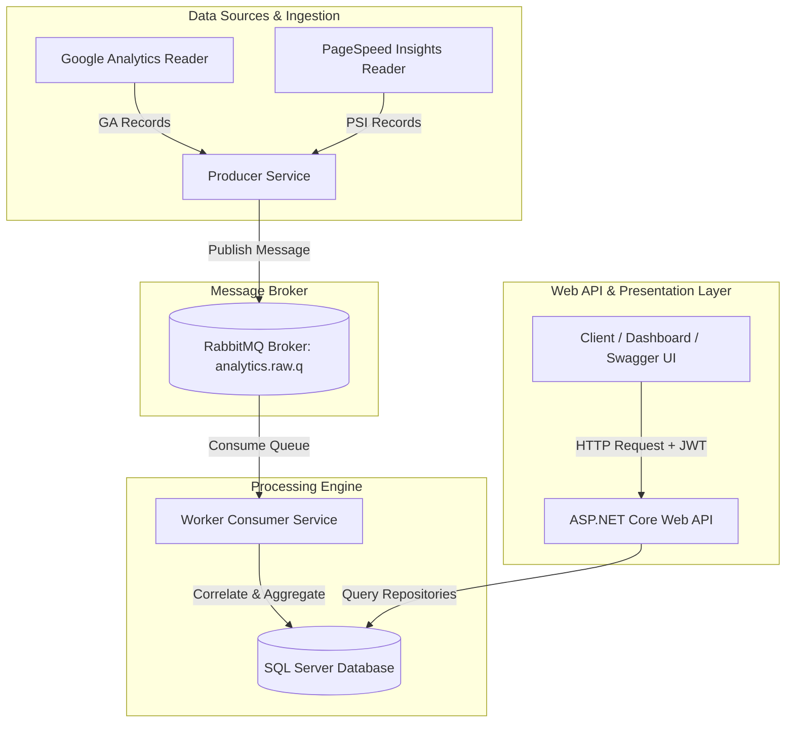

# 📊 Web Analytics Aggregator

[](https://github.com/AhmedHamdiSaeed/WebAnalyticsAggregator/actions)
[](https://ahmedhamdisaeed.github.io/WebAnalyticsAggregator/)
[](https://dotnet.microsoft.com/)
[](https://learn.microsoft.com/en-us/dotnet/csharp/)
[](https://www.rabbitmq.com/)
[](https://www.microsoft.com/en-us/sql-server/)
[](https://www.docker.com/)
[](LICENSE)

A high-performance, distributed **Web Analytics Aggregation Engine** built with **.NET 8**, **Clean Architecture**, **RabbitMQ**, **EF Core**, and **SQL Server**.

This application streams, correlates, and aggregates web analytics from multiple sources (Google Analytics pageviews/traffic + PageSpeed Insights Core Web Vitals) through asynchronous message queues, rendering unified performance dashboards and JWT-secured RESTful reporting APIs.

---

## 🌟 Visual Preview & Live Dashboard

🌐 **Live Interactive Portfolio Dashboard**: [https://ahmedhamdisaeed.github.io/WebAnalyticsAggregator/](https://ahmedhamdisaeed.github.io/WebAnalyticsAggregator/)

Check out the interactive portfolio dashboard preview live online or locally at [`docs/index.html`](docs/index.html).

```
+-----------------------------------------------------------------------------------+
|  📊 WEB ANALYTICS AGGREGATOR DASHBOARD                                             |
+-------------------+-------------------+-------------------+-----------------------+
|  Total Pageviews  |  Unique Visitors  |  Avg Core Vitals  |  Performance Score    |
|     128,450       |      42,120       |   FCP: 1.2s       |       94 / 100        |
+-------------------+-------------------+-------------------+-----------------------+
|  [📈 Pageview Trends Chart]               |  [⚡ Performance Metrics Chart]       |
|  [📋 Page Details & Scores Table]         |  [🔒 JWT Authentication Status]       |
+-------------------------------------------+---------------------------------------+
```

---

## 🏗️ System Architecture

The project adheres to **Clean Architecture** principles and implements an **Event-Driven Architecture (EDA)** pattern:



---

## ✨ Key Features

- **Distributed Data Streaming**: Asynchronous data ingest via Producer service sending telemetry to RabbitMQ queues.
- **Data Correlation Engine**: Worker consumer correlates disparate Google Analytics (GA) metrics (Pageviews, Visitors, Bounce Rates) with PageSpeed Insights (PSI) vitals (FCP, LCP, CLS) grouped by URL and Date.
- **Clean Architecture & SOLID**: Strict separation of concerns across `Domain`, `Application`, `Infrastructure`, `Producer`, `Worker`, and `API` layers.
- **JWT Authentication & Security**: Secure user registration and login endpoints utilizing PBKDF2/BCrypt password hashing and JWT Bearer tokens.
- **Comprehensive Reporting APIs**: REST endpoints providing Overview metrics, Page-level analytics, and Daily time-series trends.
- **Full Containerization**: One-command setup via `docker-compose.yml` encapsulating RabbitMQ, SQL Server, Web API, Producer, and Worker services.
- **Automated Testing Suite**: Unit and integration test suites built with xUnit, Moq, and EF Core In-Memory database.

---

## 🛠️ Technology Stack

| Category | Technology |
| :--- | :--- |
| **Framework** | .NET 8.0 SDK / C# 12 |
| **Architecture** | Clean Architecture, Layered DDD, Event-Driven |
| **Messaging** | RabbitMQ (Message Broker) |
| **Database & ORM** | SQL Server 2022, Entity Framework Core 8 |
| **Security** | JWT (JSON Web Tokens), BCrypt Password Hashing |
| **Testing** | xUnit, Moq, EF Core InMemory |
| **Containerization** | Docker, Docker Compose |
| **API Documentation** | OpenAPI / Swagger UI |

---

## 📁 Repository Structure

```
WebAnalyticsAggregator/
├── Application/                   # Application Layer (Services, Interfaces, Business Logic)
│   ├── Implementations/           # Service implementations (UserService, ReportService, etc.)
│   └── Interfaces/                # Service contracts
├── Domain/                        # Domain Layer (Entities, Value Objects, Domain Exceptions)
│   ├── Common/                    # Base entities
│   └── Exceptions/                # Custom domain exceptions
├── DTOs/                          # Data Transfer Objects (Auth, Reports, Analytics Records)
├── Infrastructure/                # Infrastructure Layer (EF Core DbContext, Repositories, Migrations)
│   ├── Data/                      # AnalyticsDbContext configuration
│   ├── Entities/                  # Persistence model definitions
│   ├── Repositories/              # UserRepository, AnalyticsRepository
│   └── Security/                  # JwtProvider, PasswordHasher
├── Producer/                      # Background Producer Service (Data Ingestion & Publishing)
│   └── Services/                  # GA/PSI Data Readers & RabbitMqPublisher
├── Worker/                        # Background Worker Service (RabbitMQ Consumer & Correlation)
├── WebAnalyticsAggregator/        # ASP.NET Core Web API (Controllers, Swagger, Auth Middleware)
│   └── Controllers/               # AuthController, ReportsController
├── Tests/                         # Automated Test Suite
│   ├── UnitTests/                 # Service & JsonAdapter tests
│   └── IntegrationTests/          # API & Repository integration tests
├── docs/                          # Interactive visual preview dashboard (index.html)
├── .github/workflows/             # CI/CD Automated Pipelines (ci.yml)
├── docker-compose.yml             # Docker Multi-container Orchestration
└── WebAnalyticsAggregator.sln     # Solution File
```

---

## 🚀 Quick Start Guide

### Prerequisites
- [.NET 8.0 SDK](https://dotnet.microsoft.com/download/dotnet/8.0)
- [Docker Desktop](https://www.docker.com/products/docker-desktop)

---

### Option 1: Running via Docker Compose (Recommended)

To launch the full system (RabbitMQ, SQL Server, Producer, Worker, and Web API):

```bash
# 1. Clone repository
git clone https://github.com/AhmedHamdiSaeed/WebAnalyticsAggregator.git
cd WebAnalyticsAggregator

# 2. Build and start all services
docker-compose up --build -d
```

#### Verification:
- **Live Interactive Dashboard**: [https://ahmedhamdisaeed.github.io/WebAnalyticsAggregator/](https://ahmedhamdisaeed.github.io/WebAnalyticsAggregator/)
- **Web API Swagger UI**: `http://localhost:8080/swagger`
- **RabbitMQ Management Console**: `http://localhost:15672` (User: `user`, Password: `password`)

---

### Option 2: Running Locally

```bash
# 1. Start RabbitMQ and SQL Server containers
docker-compose up rabbitmq db -d

# 2. Run Database Migrations & Start Web API
dotnet run --project WebAnalyticsAggregator/WebAnalyticsAggregator.csproj

# 3. Start Data Producer
dotnet run --project Producer/Producer.csproj

# 4. Start Background Worker (Consumer)
dotnet run --project Worker/Consumer.csproj
```

---

## 📖 API Documentation

### 🔑 Authentication Endpoints

| Method | Endpoint | Description | Auth Required |
| :--- | :--- | :--- | :--- |
| `POST` | `/api/auth/register` | Register a new account | ❌ No |
| `POST` | `/api/auth/login` | Authenticate user and receive JWT token | ❌ No |

#### Example Register Request (`POST /api/auth/register`)
```json
{
  "name": "Jane Doe",
  "email": "jane@example.com",
  "password": "SecurePassword123!"
}
```

#### Example Login Response (`POST /api/auth/login`)
```json
{
  "isSuccess": true,
  "data": {
    "name": "Jane Doe",
    "email": "jane@example.com",
    "token": "eyJhbGciOiJIUzI1NiIsInR5cCI6IkpXVCJ9..."
  },
  "message": "Login successful",
  "code": "LOGIN_SUCCESS"
}
```

---

### 📊 Reporting Endpoints

> **Note**: Include header `Authorization: Bearer <your_jwt_token>` for protected endpoints if enabled.

| Method | Endpoint | Description |
| :--- | :--- | :--- |
| `GET` | `/api/reports/overview` | Get aggregated global KPIs (Total pageviews, visitors, avg score) |
| `GET` | `/api/reports/pages` | Get detailed per-page metrics (FCP, LCP, CLS, Bounce rate) |
| `GET` | `/api/reports/daily?page={url}` | Get daily time-series statistics for a specific URL |

#### Example Overview Response (`GET /api/reports/overview`)
```json
{
  "totalPageviews": 154200,
  "totalVisitors": 48300,
  "averagePerformanceScore": 92.5,
  "averageFcpMs": 1150.0,
  "averageLcpMs": 2100.0,
  "averageCls": 0.04
}
```

---

## 🧪 Testing

The solution includes comprehensive unit and integration testing covering domain logic, services, DTO mappings, and repositories.

```bash
# Run all tests
dotnet test --verbosity normal
```

```
Test Run Summary:
  Passed:     12
  Failed:      0
  Skipped:     0
Total Duration: 1.2 Seconds
```

---

## 🔄 CI/CD Pipeline & GitHub Actions

Automated build and test workflows are defined in [`.github/workflows/ci.yml`](.github/workflows/ci.yml).

### How to Trigger the CI Pipeline:
1. **Automated (On Code Push / PR)**:
   Any `git push` or Pull Request targeting the `main` or `master` branch automatically triggers a fresh build, restores dependencies, executes all 12 xUnit tests, and validates Docker Compose configurations.

2. **Manual Trigger (GitHub UI)**:
   Navigate to the **Actions** tab on GitHub $\rightarrow$ Select **Build & Test CI** $\rightarrow$ Click **Run workflow** $\rightarrow$ Select branch and click **Run workflow**.

---

## 🛡️ License

Distributed under the **MIT License**. See [`LICENSE`](LICENSE) for more information.

---

## 👤 Author

**Ahmed Hamdi Saeed**
- GitHub: [@AhmedHamdiSaeed](https://github.com/AhmedHamdiSaeed)
- LinkedIn: [Ahmed Hamdi Saeed](https://linkedin.com/in/)
